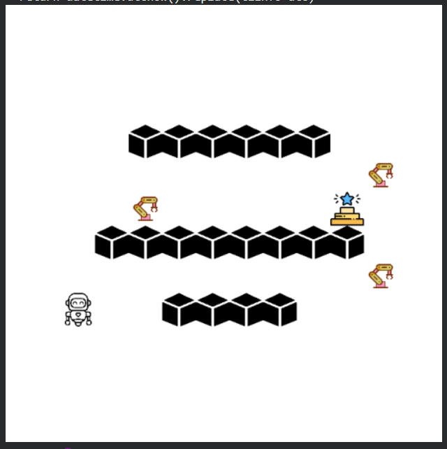
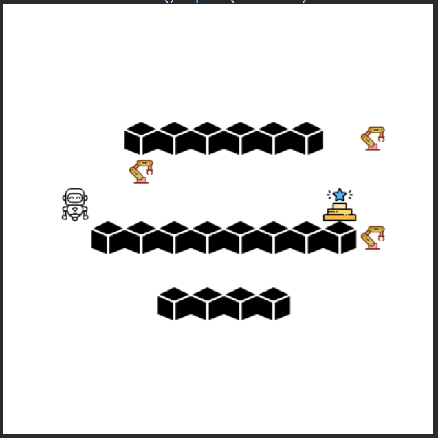
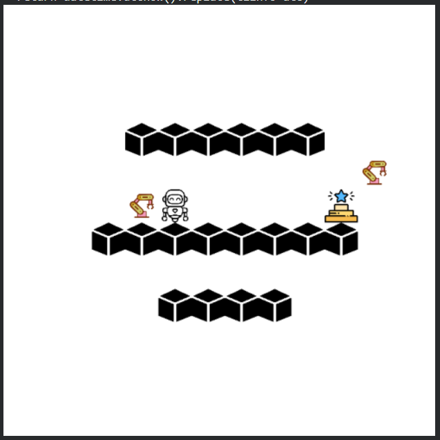
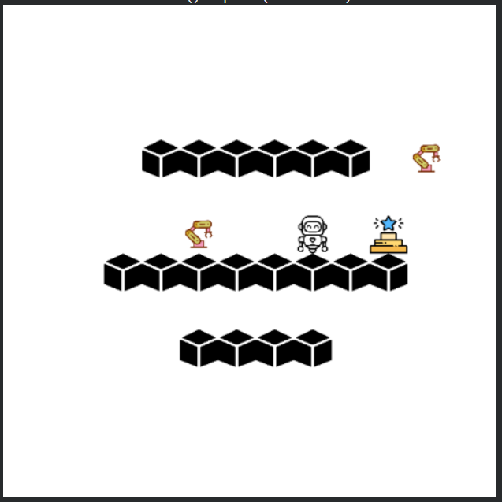
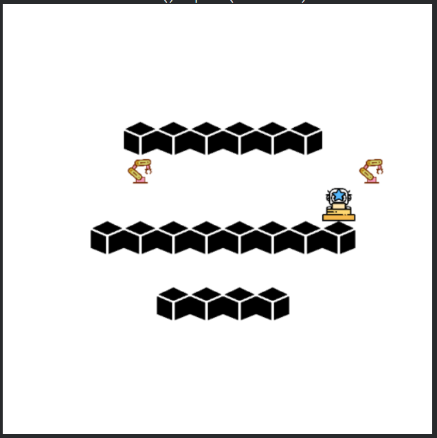

# Warehouse Navigation using PPO
## Reinforcement Learning Project

---

## 📝 Abstract
This project implements a Reinforcement Learning (RL) agent that navigates a 2D warehouse grid environment containing both static and dynamic obstacles. A custom `WarehouseEnv` simulates shelves, robots, and a goal location. The agent is trained using **Proximal Policy Optimization (PPO)** from Stable Baselines3.

The project covers environment design, reward shaping, PPO architecture, training checkpoints, and evaluation results.

---

## 📌 Features
- Custom Gym-compatible warehouse environment  
- Dynamic + static obstacles  
- PPO-based training  
- Training checkpoints  
- Visual results and navigation behavior  
- Fully simulated (no external dataset)

---

## 🚀 Problem Statement
The RL agent must:
- Reach the goal  
- Avoid static shelves  
- Avoid dynamic robots  
- Learn a safe and efficient navigation policy  

The observation space includes:
- Robot position  
- Goal position  
- Warehouse obstacle map  

---

## 🧠 RL Training Process
Training uses **Stable Baselines3 PPO**, interacting with the custom environment.

### 🎯 PPO Objective

The PPO clipped objective is:

$$
L_{\text{CLIP}}(\theta) 
= \mathbb{E}_t\left[
\min\left(
r_t(\theta)\,\hat{A}_t,\;
\text{clip}\!\left(r_t(\theta),\, 1-\epsilon,\, 1+\epsilon\right)\hat{A}_t
\right)
\right]
$$

Where:

$$
r_t(\theta)
= \frac{\pi_\theta(a_t \mid s_t)}
       {\pi_{\text{old}}(a_t \mid s_t)}
$$

$$
\hat{A}_t = \text{GAE advantage}
$$

$$
\epsilon = \text{clipping range}
$$

This stabilizes training by preventing overly large destructive updates.

---

## 🎮 Reward Structure

| Event         | Reward         |
|---------------|----------------|
| Collision     | Large negative |
| Step taken    | Small negative |
| Goal reached  | Large positive |

### Generalized Advantage Estimation (GAE)

The temporal-difference (TD) residual is:

$$
\delta_t = r_t + \gamma V(s_{t+1}) - V(s_t)
$$

The GAE advantage estimate is:

$$
\hat{A}_t
= \sum_{l=0}^{\infty} (\gamma \lambda)^l\, \delta_{t+l}
$$

---

## 🏋️ Training Steps
1. Agent interacts with environment → collects (state, action, reward, next state)  
2. Compute GAE advantages  
3. Update actor & critic networks  
4. Save model checkpoints every *50,000* timesteps  
5. Continue until convergence  

---

## 📂 Training Checkpoints
- **Initial model** – random behavior  
- **50k, 100k, 150k** – improvements in reward and collision reduction  
- **Final model** – robust navigation with efficient pathing  

---

## ✅ Outcome
The PPO agent:
- Reaches the goal consistently  
- Avoids shelves and moving robots  
- Learns short, efficient paths  
- Shows stability and convergence  

---

## 📷 Results
The following outputs were generated during evaluation:
- Initial grid layout  
- Movement across grid  
- Dynamic obstacle avoidance  
- Final goal reach  

Below are the visual outputs generated by the RL agent during navigation:

<b>Figure 1:</b> Initial warehouse layout.

<b>Figure 2:</b> Movement towards goal.

<b>Figure 3:</b> Avoiding dynamic obstacles.

<b>Figure 4:</b> Proceeds towards goal.

<b>Figure 5:</b> Goal reached successfully.

---

## 🏁 Conclusion
This project demonstrates the application of **Proximal Policy Optimization** for warehouse navigation.  
It forms a strong base for:
- Multi-agent navigation  
- Real robot deployment  
- More advanced warehouse automation systems  

---

## 👥 Authors
- Samridh Ramesha  
- Ansh Goyal  
- Chandan Singh  
- Bhanodhay Rao  

---

